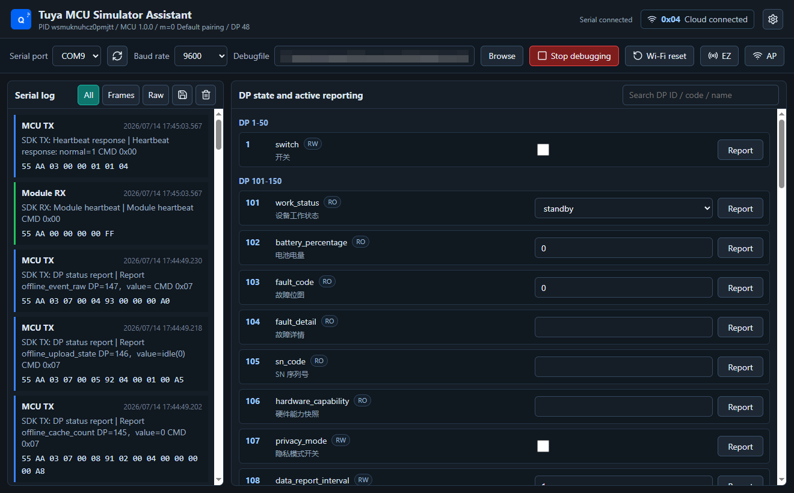
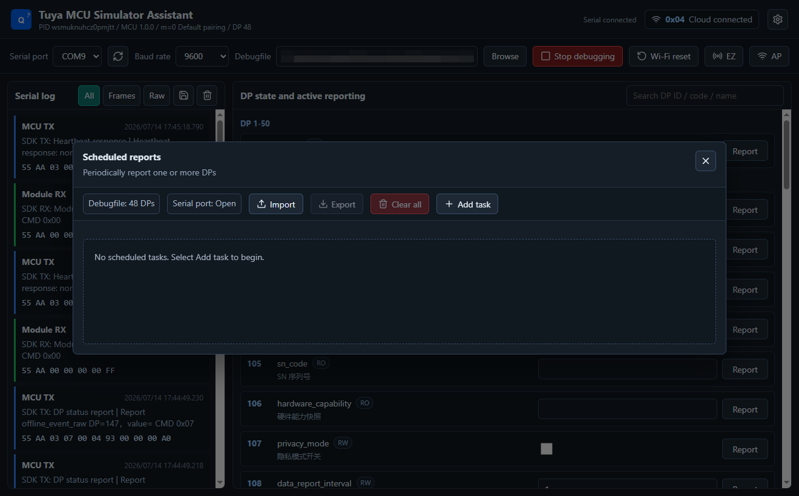
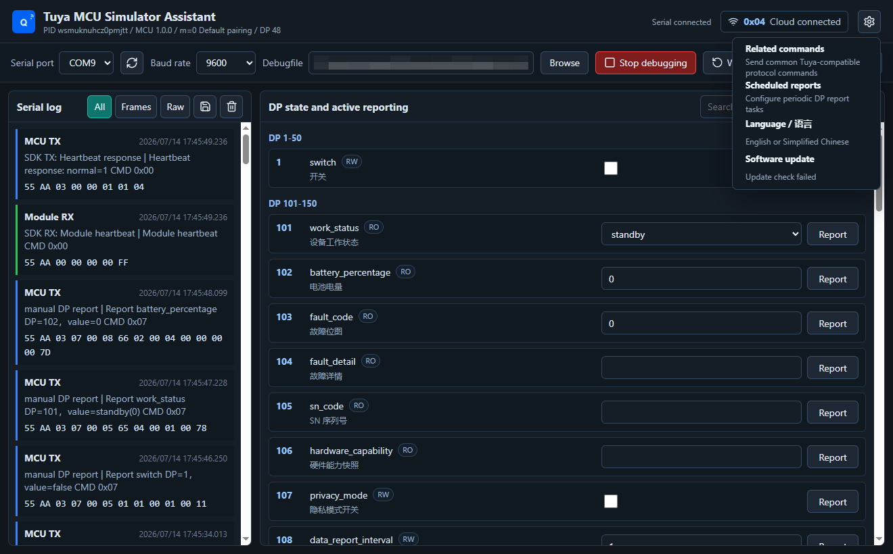

# Tuya MCU Simulator Assistant

[中文](README.md) | [English](README.en.md)

A cross-platform desktop tool built with Tauri, React, and Rust. It connects a computer to a physical module through USB-TTL and simulates the device MCU for Tuya-compatible serial protocol and DP testing.

> This is an independent, unofficial open-source project. It is not affiliated with, authorized by, or endorsed by Tuya Inc. “Tuya”, “涂鸦”, and related marks belong to their respective owners.

## Features

- Loads a Tuya Debugfile JSON manually; no device profile is bundled.
- Handles `55 AA` frames, heartbeat, product info, work mode, network state, and DP queries.
- Stores DP downloads and actively reports the resulting state.
- Supports manual, scheduled, batch, and sequential DP reports.
- Supports DP-download trigger rules, delayed responses, and cancellable periodic report sequences.
- Runs JavaScript tasks in a QuickJS sandbox to generate related DPs, timestamps, sequences, Raw payloads, and CRC values.
- Provides Wi-Fi reset, EZ/AP provisioning, and common extension commands.
- Shows complete-frame and raw serial logs with protocol explanations.
- Switches between Simplified Chinese and English.
- Provides Windows, macOS, Linux, and Ubuntu installers with signed application updates.

## Supported platforms and installation

Download the latest installer for your platform from [GitHub Releases](https://github.com/dbdb8/tuya-mcu-simulator-assistant/releases). Use the latest stable release and do not mix installers or updater files from different versions.

| Platform      | Supported architecture      | Recommended package   | Notes                                                                |
| ------------- | --------------------------- | --------------------- | -------------------------------------------------------------------- |
| Windows 10/11 | x64                         | `.exe` or `.msi`      | The `.exe` setup program is recommended for most users               |
| macOS         | Intel x64 and Apple Silicon | Universal `.dmg`      | One universal package supports both Intel and Apple chips            |
| Linux         | x64                         | `.AppImage`           | Runs on most desktop Linux distributions without system installation |
| Ubuntu 22.04+ | x64                         | `.deb` or `.AppImage` | The `.deb` package is recommended for system-managed installation    |

### Windows

1. Download the installer whose name contains `x64-setup.exe`, or download the `.msi` package.
2. Double-click the installer and follow the setup wizard.
3. If Windows SmartScreen displays “Windows protected your PC”, first verify that the file came from the official project Release, then select “More info > Run anyway”.
4. Open “Tuya MCU Simulator Assistant” from the Start menu after installation.

In-app updates are supported by the Windows installed version. Before installing an update, the application stops serial debugging and releases the COM port, then installs the update and restarts.

### macOS

1. Download and open the Universal `.dmg` file.
2. Drag `Tuya MCU Simulator Assistant.app` into `/Applications`.
3. Start the application from the Applications folder.

The current macOS package is not yet signed and notarized with an Apple Developer ID. Some macOS versions may report that the application is damaged, cannot verify the developer, or prevent it from opening. Verify that the application came from the official project Release, then run the following commands in Terminal:

```bash
xattr -dr com.apple.quarantine "/Applications/Tuya MCU Simulator Assistant.app"
codesign --force --deep --sign - "/Applications/Tuya MCU Simulator Assistant.app"
```

The first command removes the download quarantine attribute. The second applies a local ad-hoc signature for the current computer. Only run these commands on a trusted application downloaded from the official project Release, then reopen the application.

### Linux AppImage

1. Download the `.AppImage` file.
2. Open a terminal in the download directory and make it executable:

```bash
chmod +x "Tuya MCU Simulator Assistant"*.AppImage
./"Tuya MCU Simulator Assistant"*.AppImage
```

An AppImage does not require installation and can be moved to any permanent directory. In-app updates are supported when the application is launched as an AppImage. If the application reports that FUSE is missing, install the FUSE runtime package provided by your Linux distribution.

### Ubuntu DEB

1. Download the `.deb` file.
2. Run the following command from the download directory:

```bash
sudo apt install ./tuya-mcu-simulator-assistant*.deb
```

After installation, open the application from the desktop application menu. To uninstall it, run:

```bash
sudo apt remove tuya-mcu-simulator-assistant
```

Ubuntu DEB installations are managed by the system package manager. The application can check for updates and open the GitHub Release page, but the user must download the new `.deb` file and run the installation command again.

### Linux serial-port permissions

If the serial port is visible on Linux or Ubuntu but opening it reports insufficient permissions, add the current user to the `dialout` group:

```bash
sudo usermod -aG dialout "$USER"
```

Log out and sign in again before reconnecting the USB-TTL adapter. Common serial device names include `/dev/ttyUSB0` and `/dev/ttyACM0`.

## Screenshots

### Main workbench

After loading a Debugfile and opening the serial port, the workbench shows validated protocol traffic, network state, and current DP values. It also supports manual DP reports and Wi-Fi provisioning actions.



### Scheduled reports

Scheduled tasks support multiple DPs, fixed or random timing, manual value rotation, random values, run limits, and network-state gates.



### Settings menu

The settings menu provides related protocol commands, scheduled reports, language selection, and software update controls.



## Development

Node.js 20+, Rust stable, and the platform-specific Tauri build dependencies are required.

```bash
npm install
npm run tauri:dev
```

Run the project checks before submitting changes:

```bash
npm run lint
npm run format:check
npm run build
cargo fmt --manifest-path src-tauri/Cargo.toml -- --check
cargo clippy --manifest-path src-tauri/Cargo.toml --all-targets -- -D warnings
cargo test --manifest-path src-tauri/Cargo.toml
```

See the [development guide](docs/tuya-mcu-simulator-development-guide.en.md), [JavaScript scheduled-report tutorial](docs/javascript-timer-script-guide.en.md), and [release guide](docs/software-update-release-guide.en.md) for details.

## License

Licensed under the [MIT License](LICENSE). See [THIRD_PARTY_NOTICES.md](THIRD_PARTY_NOTICES.md) for third-party notices.
