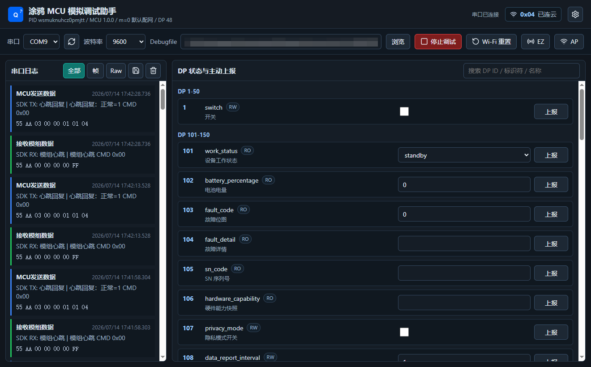
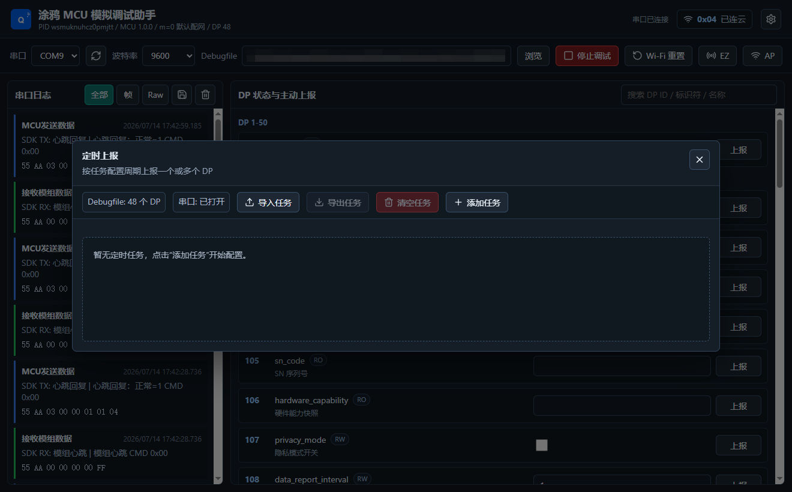
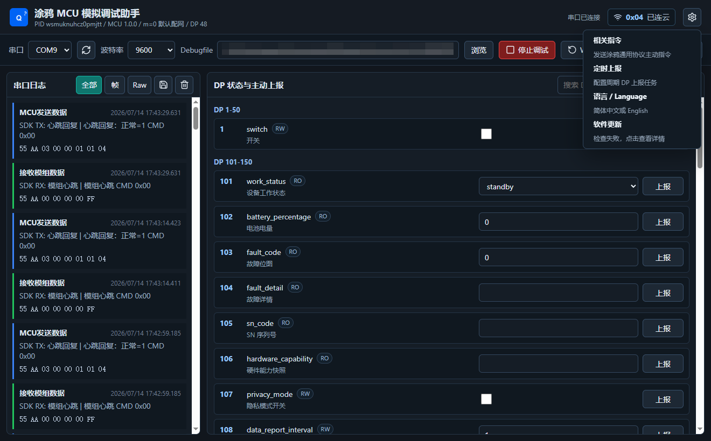

# 涂鸦 MCU 模拟调试助手

[中文](README.md) | [English](README.en.md)

一个基于 Tauri、React 和 Rust 的跨平台桌面工具。电脑通过 USB-TTL 连接真实模组并模拟设备 MCU，可用于调试涂鸦通用 MCU 串口协议、DP 下发与主动上报。

> 本项目是独立的非官方开源工具，与 Tuya Inc.（涂鸦智能）不存在隶属、授权或背书关系。“Tuya”和“涂鸦”及相关商标归其权利人所有。

## 功能

- 手动加载 Tuya Debugfile JSON，不内置设备或产品 Profile。
- `55 AA` 协议帧解析、心跳、产品信息、工作模式、配网状态和 DP 查询。
- 保存 App/模组下发的最新 DP，并主动回报当前状态。
- DP 手动上报、批量/逐个定时上报、随机值和多值轮询。
- 支持 QuickJS 沙箱中的 JavaScript 动态任务，一次生成多个关联 DP、时间戳、序号、Raw 和 CRC。
- Wi-Fi reset、EZ/AP 配网和常用扩展指令。
- 完整帧与 Raw 串口日志、协议语义解释和日志导出。
- 中文和英文界面切换。
- Windows、macOS、Linux 和 Ubuntu 安装包及签名软件更新。

## 支持平台与安装

请从项目的 [GitHub Releases](https://github.com/dbdb8/tuya-mcu-simulator-assistant/releases) 下载对应平台的最新安装包。建议优先选择最新稳定版本，不要混用不同版本的安装包和更新文件。

| 平台          | 支持架构                 | 推荐安装包            | 说明                                       |
| ------------- | ------------------------ | --------------------- | ------------------------------------------ |
| Windows 10/11 | x64                      | `.exe` 或 `.msi`      | 普通用户优先使用 `.exe` 安装程序           |
| macOS         | Intel x64、Apple Silicon | Universal `.dmg`      | 通用包同时支持 Intel 和 Apple 芯片         |
| Linux         | x64                      | `.AppImage`           | 适合多数桌面 Linux 发行版，无需系统级安装  |
| Ubuntu 22.04+ | x64                      | `.deb` 或 `.AppImage` | Ubuntu 推荐使用 `.deb`，便于系统管理和卸载 |

### Windows

1. 下载名称中包含 `x64-setup.exe` 的安装程序，或下载 `.msi` 安装包。
2. 双击安装并按提示完成操作。
3. 如果 Windows SmartScreen 显示“Windows 已保护你的电脑”，请先确认文件来自本项目官方 Release，再点击“更多信息 > 仍要运行”。
4. 安装完成后，从开始菜单打开“Tuya MCU Simulator Assistant”。

应用内更新支持 Windows 安装版。更新前应用会停止串口调试并释放 COM 口，然后完成安装和重启。

### macOS

1. 下载 Universal `.dmg` 文件并打开。
2. 将 `Tuya MCU Simulator Assistant.app` 拖入 `/Applications`。
3. 从“应用程序”目录启动应用。

当前 macOS 安装包尚未使用 Apple Developer ID 签名和公证，部分系统会提示应用已损坏、无法验证开发者或直接阻止打开。请确认应用来自本项目的 GitHub Release，然后在“终端”执行：

```bash
xattr -dr com.apple.quarantine "/Applications/Tuya MCU Simulator Assistant.app"
codesign --force --deep --sign - "/Applications/Tuya MCU Simulator Assistant.app"
```

第一条命令移除下载隔离属性，第二条命令为应用生成当前电脑使用的临时签名。仅对来源可信的官方 Release 文件执行这些命令，完成后重新打开应用。

### Linux AppImage

1. 下载 `.AppImage` 文件。
2. 在终端进入下载目录并授予执行权限：

```bash
chmod +x "Tuya MCU Simulator Assistant"*.AppImage
./"Tuya MCU Simulator Assistant"*.AppImage
```

AppImage 不需要安装，可以移动到任意固定目录后直接运行。使用 AppImage 启动时支持应用内更新；部分 Linux 发行版若提示缺少 FUSE，需要先安装该发行版对应的 FUSE 运行库。

### Ubuntu DEB

1. 下载 `.deb` 文件。
2. 在下载目录执行：

```bash
sudo apt install ./tuya-mcu-simulator-assistant*.deb
```

安装后可从应用菜单启动。卸载命令：

```bash
sudo apt remove tuya-mcu-simulator-assistant
```

Ubuntu DEB 由系统包管理器维护，应用内只检查新版本并跳转到 GitHub Release，需要用户下载新的 `.deb` 后重新执行安装命令。

### Linux 串口权限

如果 Linux/Ubuntu 可以看到串口但打开时提示权限不足，将当前用户加入 `dialout` 组：

```bash
sudo usermod -aG dialout "$USER"
```

执行后注销并重新登录，再连接 USB-TTL。常见串口设备名称为 `/dev/ttyUSB0` 或 `/dev/ttyACM0`。

## 界面预览

### 主工作台

加载 Debugfile 并打开串口后，可以查看完整协议日志、网络状态和当前 DP，同时手动触发 DP 上报及 Wi-Fi 配网操作。



### 定时上报

定时任务支持多个 DP、固定或随机周期、手动值轮询、随机值、执行次数和网络状态触发。



### 设置菜单

设置菜单集中提供相关指令、定时上报、界面语言和软件更新入口。



## 开发

要求 Node.js 20+、Rust stable 和对应平台的 Tauri 构建依赖。

```bash
npm install
npm run tauri:dev
```

常用检查：

```bash
npm run lint
npm run format:check
npm run build
cargo fmt --manifest-path src-tauri/Cargo.toml -- --check
cargo clippy --manifest-path src-tauri/Cargo.toml --all-targets -- -D warnings
cargo test --manifest-path src-tauri/Cargo.toml
```

## 使用

1. 使用 USB-TTL 连接模组协议串口并共地。
2. 打开应用，手动选择 Debugfile JSON。
3. 选择串口和波特率，默认波特率为 `9600`。
4. 点击“开始调试”，观察初始化、配网和 DP 交互日志。

详细实现见[开发指南](docs/tuya-mcu-simulator-development-guide.md)，动态任务编写见 [JavaScript 定时上报脚本教程](docs/javascript-timer-script-guide.md)，发布与自动更新见[发布指南](docs/software-update-release-guide.md)。

## 贡献与安全

提交代码前请阅读 [CONTRIBUTING.md](CONTRIBUTING.md)。安全问题请按 [SECURITY.md](SECURITY.md) 私下报告，不要在 Issue 中公开密钥或设备凭据。

## 许可证

本项目使用 [MIT License](LICENSE)。第三方依赖声明见 [THIRD_PARTY_NOTICES.md](THIRD_PARTY_NOTICES.md)。
