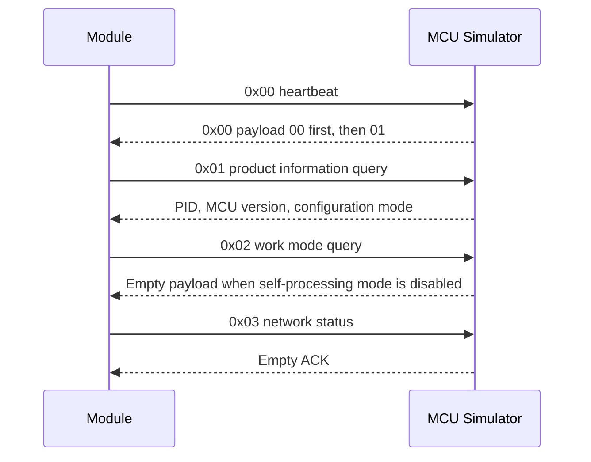
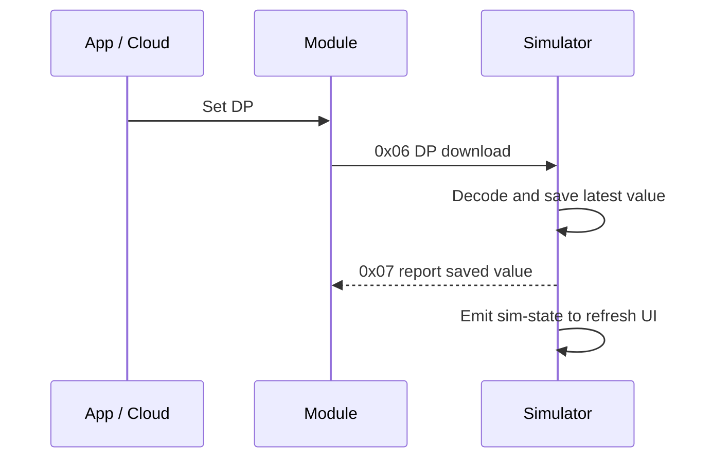

# Tuya MCU Simulator Development Guide

[中文](./tuya-mcu-simulator-development-guide.md)

This guide describes how to reuse this project to simulate a new MCU device over the Tuya-compatible serial protocol. The desktop application connects to a real module through USB-TTL, acts as the MCU, loads device definitions from a Debugfile, stores downloaded DP values, and produces active or scheduled DP reports.

## Scope and Architecture

- No device profile is loaded at startup. A Debugfile JSON must be selected manually.
- The application does not call cloud APIs or store cloud credentials.
- React/Vite implements the workbench, logs, DP controls, scheduled reports, language settings, and updater UI.
- Rust/Tauri owns serial I/O, frame parsing, protocol responses, DP encoding, diagnostics, and update environment detection.
- `FrameParser` preserves partial headers and payloads across `read()` calls, handles concatenated frames, and recovers after bad checksums.

## Frame Format

```text
55 AA | version | command | length(2, big-endian) | payload | checksum
```

The simulator transmits version `0x03` and accepts common module frames using version `0x00`. The checksum is the wrapping sum of every byte before the checksum byte. Serial settings are explicitly configured as 9600 baud by default, 8 data bits, no parity, one stop bit, and no flow control.

## Initialization Sequence



## Common Commands

| Command | Meaning             | Simulator behavior                                                         |
| ------- | ------------------- | -------------------------------------------------------------------------- |
| `0x00`  | Heartbeat           | First response `00`, later responses `01`                                  |
| `0x01`  | Product information | Returns PID, MCU version, and pairing mode from the Debugfile              |
| `0x02`  | Work mode           | Returns an empty payload in the current generic mode                       |
| `0x03`  | Network status      | Stores the status, updates the UI, and sends an empty ACK                  |
| `0x04`  | Wi-Fi reset         | Active MCU reset request and module acknowledgement                        |
| `0x05`  | Pairing mode        | Selects EZ/SmartConfig or AP mode                                          |
| `0x06`  | DP download         | Decodes and stores values, refreshes the UI, then reports the saved values |
| `0x07`  | DP report           | Encodes one or more current DP values                                      |
| `0x08`  | Query all DPs       | Reports all current DP values, normally as separate frames                 |

The related-command dialog also covers memory, signal strength, UTC/local time, heartbeat stop, network state, MAC address, and capability notification commands.

## DP Encoding

The Debugfile is the only source of PID and DP metadata. Supported kinds are `bool`, `value`, `enum`, `string`, `raw`, and `bitmap`. Enum bytes are indexes into the Debugfile `range`; value and bitmap payloads use integer encoding; raw data is validated as hexadecimal; strings use UTF-8. Read-only DPs remain reportable because the tool simulates the device side, where read-only means the App cannot download the value, not that the MCU cannot report it.

## DP Download and Report Flow



Scheduled tasks can report multiple DPs in one frame or sequential frames, rotate manual candidate values, generate constrained random values, wait for a network state, and stop after a run limit. Task configurations can be imported and exported, but they do not auto-start after application restart.

## JavaScript Dynamic Reports

A task can use JavaScript generation mode to return several related DPs in one execution. Scripts run in a Rust QuickJS sandbox without file, network, environment, process, Tauri, or serial APIs.

```javascript
function generate(ctx) {
  return {
    reports: [
      { code: "status", value: "running" },
      { code: "raw_data", value: raw([1, 2, 3]) },
    ],
    state: { seq: Number(ctx.state.seq || 0) + 1 },
    summary: "dynamic report",
  };
}
```

The context exposes the current time, run index, persistent script state, current DP values, schema, and network status. Helper functions cover random values, little-endian integers, CRC16-Modbus, hex, JSON, and Raw data. Rust validates every returned DP against the loaded Debugfile. Script state is committed only after a successful serial report; previews never mutate state. Imports containing scripts require explicit confirmation and remain disabled after import.

See the [JavaScript Scheduled Dynamic Report Tutorial](./javascript-timer-script-guide.en.md) for the full creation workflow, context reference, DP value examples, state rules, Raw packet assembly, CRC, and troubleshooting.

## Troubleshooting and Extension Checklist

1. Compare complete validated frames with the official module assistant; use Raw mode only for physical read chunks.
2. Confirm PID, configuration mode, and initialization order before investigating DP behavior.
3. Add device-specific behavior only after documenting the actual MCU source or captured sequence.
4. Keep protocol parsing independent from log descriptions; localized text must never affect frame bytes.
5. Add regression tests for partial frames, concatenated frames, bad checksums, initialization commands, and each device-specific DP rule.
6. Validate with `npm run build`, `cargo test --manifest-path src-tauri/Cargo.toml`, and a real module over USB-TTL.

Tuya is a trademark of its respective owner. This project is an independent, unofficial tool and is not affiliated with, authorized by, or endorsed by Tuya.
