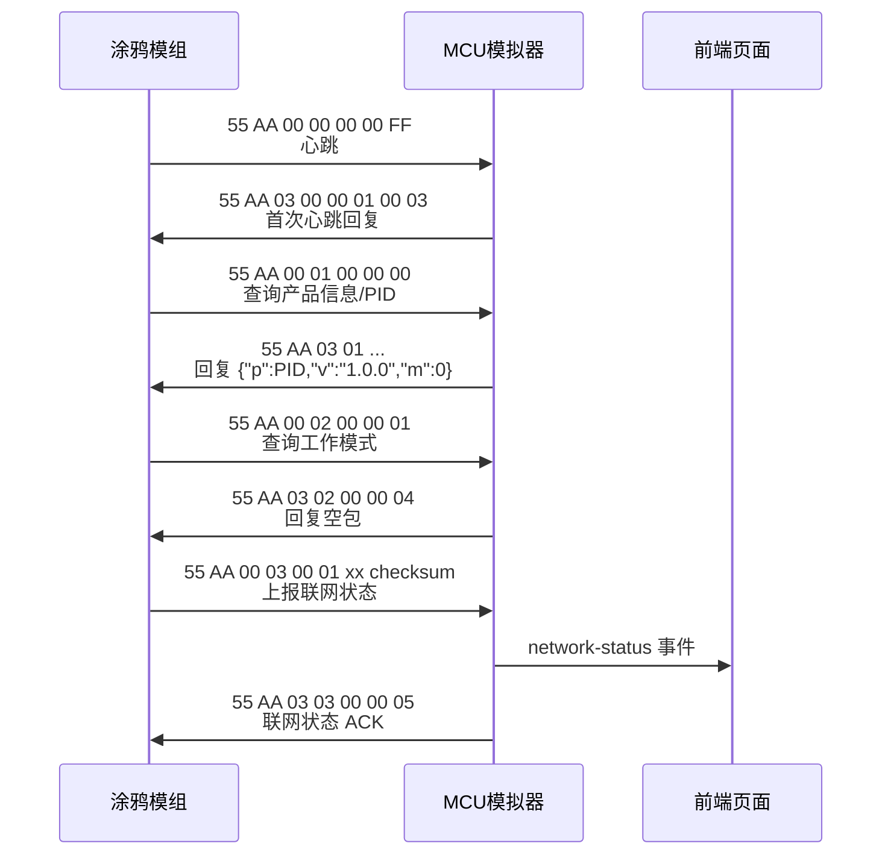
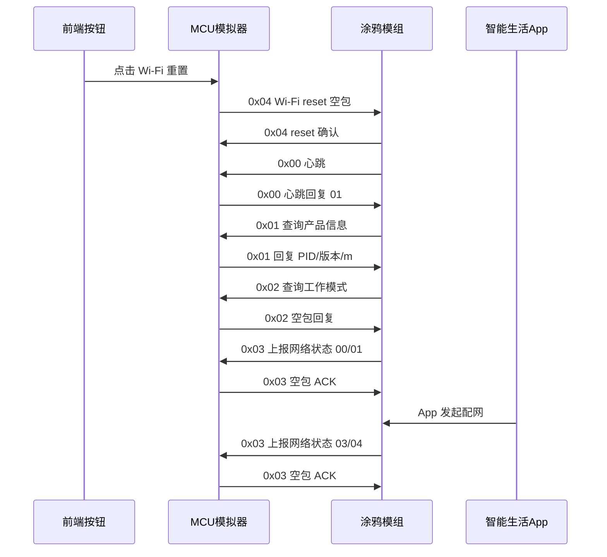
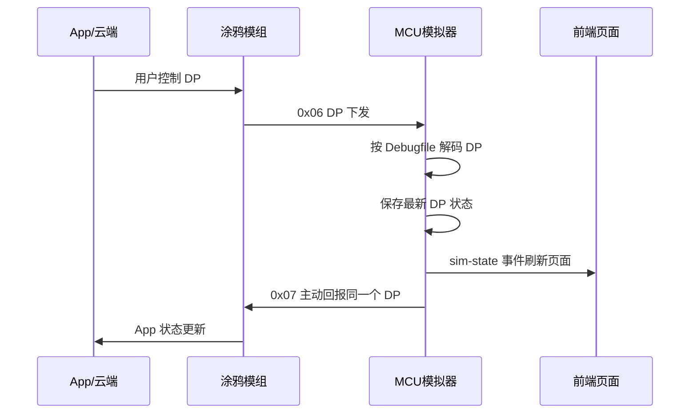
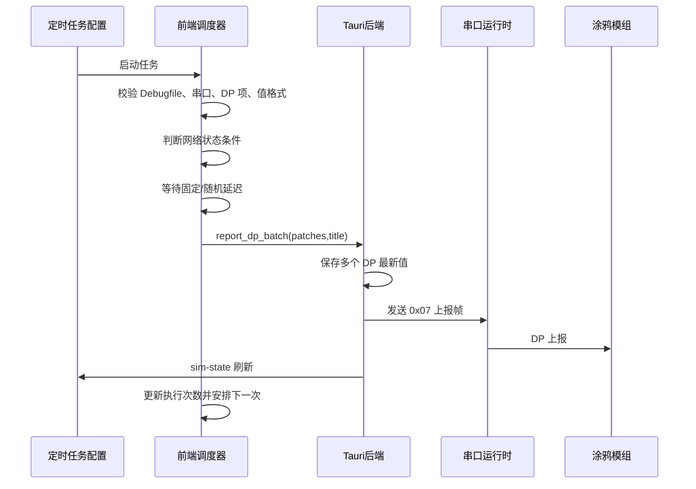

# 涂鸦 MCU 模拟器开发过程与对接细节

本文档整理当前 `tuya-mcu-simulator-assistant` 的开发过程、协议对接流程和关键交互时序，方便后续基于同一套框架开发新的涂鸦 MCU 模拟器。

当前工具定位是：PC 通过 USB-TTL 连接真实涂鸦模组，桌面应用扮演 MCU，按涂鸦通用 MCU 串口协议响应模组请求，并根据用户手动加载的 Debugfile 处理 DP 下发、主动上报和定时上报。

## 1. 当前实现边界

- 应用启动后默认不加载任何设备配置，必须手动加载涂鸦 Debugfile JSON。
- 当前为通用 MCU 模拟模式，不内置任何设备专有 Profile。
- 串口交互只连接真实涂鸦模组，不调用涂鸦云 API，不保存云账号、密钥或 token。
- DP 状态保存在应用内存中，重启后需要重新加载 Debugfile。
- 定时任务配置可保存在本地并支持导入/导出，但应用重启后不会自动启动任务，避免误发 DP。
- MCU 发送帧统一使用协议版本 `0x03`；接收模组帧兼容常见版本 `0x00`。

## 2. 项目架构

```text
tuya-mcu-simulator-assistant
├─ src/                       前端 React/Vite 工作台
│  ├─ App.tsx                 页面编排与跨模块状态协调
│  ├─ features/               DP、日志、设置、定时上报和更新功能
│  └─ main.tsx                React 入口
├─ src-tauri/src/
│  ├─ lib.rs                  Tauri 命令入口、全局状态、文件加载
│  ├─ tuya_protocol.rs        55 AA 帧封包、解析、校验和、命令常量
│  ├─ serial_runtime.rs       串口线程、协议路由、日志解释、错误诊断
│  ├─ dp_schema.rs            Debugfile JSON 解析与 DP 元数据
│  └─ dp_simulator.rs         通用 DP 状态保存、编解码、上报生成
└─ docs/
   └─ tuya-mcu-simulator-development-guide.md
```

核心分层如下：

- `tuya_protocol`：只负责通用帧格式，不关心设备业务。
- `dp_schema`：把 Debugfile 转成统一 DP 元数据，提供 `by_id`、`by_code` 查询。
- `dp_simulator`：维护当前 DP 值，处理 App/模组下发和用户主动上报。
- `serial_runtime`：串口读写、半包/粘包解析、命令路由、自动回复、日志解释。
- `main.tsx`：调试工作台、设置菜单、相关指令弹窗、定时上报任务调度。

后续开发新设备模拟器时，优先复用通用层，只在“设备业务联动”确实需要时扩展状态机。

## 3. 涂鸦通用串口帧

### 3.1 帧格式

```text
55 AA | version | command | len_hi len_lo | payload... | checksum
```

字段说明：

| 字段     | 长度 | 当前实现                                 |
| -------- | ---: | ---------------------------------------- |
| 帧头     |    2 | 固定 `55 AA`                             |
| version  |    1 | MCU 发送 `0x03`，接收不限制              |
| command  |    1 | 涂鸦 MCU 命令字                          |
| length   |    2 | payload 长度，大端序                     |
| payload  |    N | 命令数据                                 |
| checksum |    1 | 从帧头到 payload 的所有字节累加取低 8 位 |

示例：MCU 回复正常心跳。

```text
55 AA 03 00 00 01 01 04
```

含义：

- `55 AA`：帧头
- `03`：MCU 发送协议版本
- `00`：心跳命令
- `00 01`：payload 长度 1
- `01`：正常心跳回复
- `04`：校验和

### 3.2 半包、粘包和校验恢复

串口 `read()` 可能一次只读到半帧，也可能读到多帧粘包。当前 `FrameParser` 的关键处理规则：

- buffer 中找不到完整 `55 AA` 时，如果末尾是单字节 `55`，保留该字节等待下一次 `AA`。
- 已找到 `55 AA` 但不足 7 字节，继续等待。
- payload 长度不足完整帧长度，继续等待。
- 校验失败时只丢弃当前候选帧头的 `55`，继续寻找后续 `55 AA`，避免一个坏字节清掉后面的好帧。

这个处理是对齐官方调试助手日志时修复过的重点问题。不要再把“收到字节但暂未组成完整帧”直接判定为接线错误。

## 4. 关键命令表

| 命令   | 方向        | 语义                    | 当前行为                                    |
| ------ | ----------- | ----------------------- | ------------------------------------------- |
| `0x00` | 模组 -> MCU | 心跳                    | 首次回复 `00`，后续回复 `01`                |
| `0x01` | 模组 -> MCU | 查询产品信息/PID        | 回复 Debugfile PID、MCU 版本、配网模式      |
| `0x02` | 模组 -> MCU | 查询工作模式            | 回复空 payload，表示未启用 Wi-Fi 自处理模式 |
| `0x03` | 模组 -> MCU | 上报联网状态            | 保存状态、推送 UI、回复空 payload ACK       |
| `0x04` | MCU -> 模组 | Wi-Fi reset             | 发送空 payload reset 帧                     |
| `0x05` | MCU -> 模组 | 设置配网模式            | payload `00` 为 EZ/SmartConfig，`01` 为 AP  |
| `0x06` | 模组 -> MCU | DP 下发                 | 解析、保存最新值、主动 `0x07` 回报          |
| `0x07` | MCU -> 模组 | DP 上报                 | 手动、定时、下发回报都走该命令              |
| `0x08` | 模组 -> MCU | 全量 DP 查询            | 按当前状态逐个上报所有 DP                   |
| `0x0C` | MCU -> 模组 | 获取格林时间            | 相关指令按钮触发                            |
| `0x0F` | MCU -> 模组 | 查询内存/OTA 包大小     | 相关指令按钮触发                            |
| `0x1C` | MCU -> 模组 | 获取本地时间            | 相关指令按钮触发                            |
| `0x24` | MCU -> 模组 | 查询信号强度/Wi-Fi 测试 | 相关指令按钮触发                            |
| `0x25` | MCU -> 模组 | 停止心跳                | 相关指令按钮触发                            |
| `0x2B` | MCU -> 模组 | 获取联网状态            | 相关指令按钮触发                            |
| `0x2D` | MCU -> 模组 | 获取 MAC                | 相关指令按钮触发                            |
| `0x37` | MCU -> 模组 | 新功能设置通知          | 子命令 `0x00` + JSON 能力 payload           |

网络状态枚举：

| 值     | 说明               |
| ------ | ------------------ |
| `0x00` | SmartConfig 配网中 |
| `0x01` | AP 配网中          |
| `0x02` | 已配置但未连路由   |
| `0x03` | 已连路由           |
| `0x04` | 已连云             |
| `0x05` | 低功耗             |
| `0x06` | Smart/AP 共存配网  |
| `0xFF` | 未知               |

## 5. 基础对接流程

### 5.1 工具启动到开始调试

1. 用户打开应用。
2. 应用只恢复上次选择的串口、波特率、Debugfile 路径显示，不自动加载任何内置 Profile。
3. 用户手动选择 Debugfile JSON。
4. 后端解析 Debugfile，生成 `DpSchema`，初始化 `DpSimulator` 默认 DP 状态。
5. 用户选择串口和波特率，默认 `9600`。
6. 点击“开始调试”。
7. 后端同步打开串口，成功后再启动后台读写线程。
8. 如果串口被占用、不存在、权限不足或参数错误，立即返回结构化中文错误。

### 5.2 模组启动初始化时序



心跳规则：

- 串口运行线程启动后，第一次收到心跳回复 `00`，表示 MCU 刚启动。
- 后续心跳回复 `01`，表示 MCU 正常工作。
- 点击 Wi-Fi reset 不等同于 MCU 重启，因此不会把后续心跳重新改成首次 `00`。

产品信息规则：

```json
{ "p": "Debugfile中的Pro_Key", "v": "1.0.0", "m": 0 }
```

- `p` 来自 Debugfile 的 `Pro_Key`。
- `v` 当前默认为 `1.0.0`。
- `m` 当前默认为 `0`，表示默认配网。
- 如果后续某设备需要特殊配网模式，应在 schema 或设备扩展层明确配置。

工作模式规则：

- 当前未启用 `WIFI_CONTROL_SELF_MODE`。
- `0x02` 工作模式查询回复空 payload。
- 含义是 Wi-Fi reset 或配网按键由 MCU 侧自行处理，而不是模组自处理。

## 6. Wi-Fi reset 与配网流程

### 6.1 Wi-Fi reset

点击“Wi-Fi 重置”时，MCU 模拟器主动发送：

```text
55 AA 03 04 00 00 06
```

注意：

- 只发送 `0x04` reset 空包。
- 不自动追加 `0x05` 配网模式。
- 模组返回 `0x04` 后，日志标记 Wi-Fi reset 已确认。
- reset 后模组通常会重新发心跳、查询产品信息、查询工作模式、上报联网状态。

### 6.2 EZ/AP 配网模式

点击 EZ/SmartConfig：

```text
55 AA 03 05 00 01 00 08
```

点击 AP：

```text
55 AA 03 05 00 01 01 09
```

### 6.3 Wi-Fi reset 后配网握手时序



配网过程中重点看日志解释：

- `模组上报网络状态：0x00 SmartConfig 配网中`
- `模组上报网络状态：0x01 AP 配网中`
- `模组上报网络状态：0x03 已连路由`
- `模组上报网络状态：0x04 已连云`

## 7. Debugfile 与 DP 数据模型

### 7.1 Debugfile 字段映射

当前 `DpSchema::from_path()` 读取涂鸦 Debugfile JSON：

| Debugfile 字段             | 内部字段        | 说明                       |
| -------------------------- | --------------- | -------------------------- |
| `Pro_Key`                  | `product_key`   | 产品 PID                   |
| `Dp_Data[].id`             | `DpPoint.id`    | DP ID，协议 payload 中使用 |
| `Dp_Data[].code`           | `DpPoint.code`  | 页面和 Tauri 命令使用      |
| `Dp_Data[].name`           | `DpPoint.name`  | UI 展示                    |
| `Dp_Data[].mode`           | `DpPoint.mode`  | 读写属性                   |
| `Dp_Data[].property.type`  | `DpPoint.kind`  | DP 类型                    |
| `Dp_Data[].defaultValue`   | `default_value` | 初始值                     |
| `Dp_Data[].property.range` | enum range      | enum 文案与下标映射        |

当前支持类型：

- `bool`
- `value`
- `enum`
- `string`
- `raw`
- `bitmap`

### 7.2 DP payload 格式

DP 下发和上报 payload 都由一个或多个 DP item 组成：

```text
dp_id | dp_type | len_hi len_lo | data...
```

DP 类型映射：

| 类型   | type byte | 编码                 |
| ------ | --------: | -------------------- |
| raw    |    `0x00` | 原始字节             |
| bool   |    `0x01` | 1 字节，`00/01`      |
| value  |    `0x02` | 4 字节大端无符号整数 |
| string |    `0x03` | UTF-8 字节           |
| enum   |    `0x04` | 1 字节下标           |
| bitmap |    `0x05` | 4 字节大端无符号整数 |

### 7.3 enum 映射

涂鸦协议中的 enum payload 是数字下标。应用内为了方便用户配置，优先使用 Debugfile `range` 中的字符串。

示例：

```json
{
  "type": "enum",
  "range": ["standby", "power_on", "moving"]
}
```

协议 `01` 解码后页面显示为 `"power_on"`；页面或定时任务填写 `"power_on"` 时，上报编码回 `01`。

## 8. DP 下发、保存和回报

### 8.1 App 下发到 MCU 回报时序



当前通用模式的原则：

- 收到 `0x06` 后按 DP id 查 `DpSchema`。
- 解码 payload 得到 JSON 值。
- 保存到 `DpSimulator.values`。
- 生成 `DpReport`。
- 用 `0x07` 主动上报。
- 立即 emit `sim-state`，页面以真实后端状态覆盖显示。

默认通用层只负责 DP 的解析、状态保存和主动上报，不包含任何产品业务联动。确有需要时，应在独立的可选扩展层实现产品自定义规则，避免影响通用协议行为。

### 8.2 全量 DP 查询

模组发送 `0x08` 时：

- 后端调用 `all_reports(schema)` 获取当前所有 DP 状态。
- 当前实现优先拆成多个单 DP `0x07` 上报帧。
- 这样更接近许多 MCU SDK 的 `all_data_update()` 行为，也避免单帧过长。

## 9. 主动上报能力

### 9.1 手动 DP 上报

页面 DP 表中修改值后：

1. 前端调用 `set_dp_value({ code, value })`。
2. 后端按 `code` 找到 DP 元数据。
3. 保存当前值。
4. 生成单 DP `0x07` 上报。
5. 推送 `sim-state` 刷新页面。

### 9.2 批量 DP 上报

定时任务或逐个上报内部复用：

```text
report_dp_batch(patches, title)
```

规则：

- 未加载 Debugfile：返回 `dp_file_required`。
- 未打开串口：返回 `command_requires_serial`。
- 多个 patch 会先全部保存到模拟状态。
- 合并上报模式：多个 DP item 合并到同一条 `0x07` 帧。
- 逐个上报模式：按任务中 DP 项顺序逐个调用，每个 DP 一条 `0x07` 帧。

### 9.3 定时上报时序



定时任务能力：

- 固定延迟或随机延迟。
- 固定间隔或随机间隔。
- 一个任务包含多个 DP。
- DP 值支持手动多值轮询或随机生成。
- 支持任务导入/导出 JSON。
- 支持复制任务。
- 支持执行次数限制。
- 支持合并上报/逐个上报。
- 支持按网络状态触发，例如已连云后才开始。
- 支持分组展示和一键清空全部定时任务。

### 9.4 JavaScript 动态上报

任务可切换为 JavaScript 生成模式。脚本在 Rust QuickJS 沙箱中执行，不具备文件、网络、环境变量、进程或串口访问权限，只能返回当前 Debugfile 中定义的 DP：

```javascript
function generate(ctx) {
  return {
    reports: [
      { code: "status", value: "running" },
      { code: "raw_data", value: raw([1, 2, 3]) },
    ],
    state: { seq: Number(ctx.state.seq || 0) + 1 },
    summary: "dynamic report",
  };
}
```

- `ctx` 提供当前时间、任务次数、持久化状态、当前 DP 值、Schema 和网络状态。
- 支持随机数、小端整数、CRC16-Modbus、hex、JSON 和 Raw 帮助函数。
- 后端会再次校验 DP 是否存在、类型、枚举、范围、步长和长度。
- 只有串口发送成功后才提交脚本状态；预览不会改变状态。
- `skip=true` 可保存状态并跳过本次发送，但不会增加成功上报次数。
- 导入包含脚本的任务时必须由用户确认，导入后仍保持未启动。

脚本的创建步骤、完整 `ctx` 字段、DP 类型写法、状态提交规则、Raw 组包、CRC 和排错方法见 [JavaScript 定时动态上报脚本教程](./javascript-timer-script-guide.md)。

### 9.5 DP 下发触发上报

触发规则在后端串口线程中执行。收到 `0x06` 后先保存下发值，并立即用单 DP `0x07` 回报原值，兼容传统 MCU 的“下发什么回什么”；如果命中规则，再按规则生成后续 `0x07` 联动上报。规则可配置一次性延迟响应或周期序列，同一序列组支持替换、忽略、排队和取消。原值回报由下载链路统一发送一次，即使命中多条规则也不会重复发送。

总开关只控制是否响应下发，与模组是否连云无关。规则启停和结构编辑采用原子热更新：修改中的非法规则会单独暂停，修复后自动恢复；修改正在运行的规则只取消该规则的旧调度，不影响其他规则或总开关。JavaScript 规则额外获得 `ctx.trigger` 和 `ctx.sequence`，返回 `complete=true` 可在本次成功上报后结束序列。关闭总开关、切换 Debugfile 或关闭串口时仍会清空全部待执行响应。

## 10. 相关指令

相关指令入口位于右上角设置菜单。当前实现不把这些按钮放在首页，避免占用调试主界面。

| 按钮           | 命令   | payload     | 日志关注点             |
| -------------- | ------ | ----------- | ---------------------- |
| 查询内存       | `0x0F` | 空          | 返回内存大小           |
| 查询信号强度   | `0x24` | 空          | RSSI，按有符号整数显示 |
| 获取格林时间   | `0x0C` | 空          | 年月日时分秒           |
| 获取本地时间   | `0x1C` | 空          | 年月日时分秒和星期     |
| 停止心跳       | `0x25` | 空          | 模组确认停止心跳       |
| 获取联网状态   | `0x2B` | 空          | 同网络状态枚举         |
| 获取 MAC       | `0x2D` | 空          | `AA:BB:CC:DD:EE:FF`    |
| 新功能设置通知 | `0x37` | `00` + JSON | 当前使用 OTA 能力 JSON |

新功能设置通知当前 payload：

```text
00 {"OTAMethod":2,"Abv":1,"Buff":256}
```

## 11. 串口日志与错误诊断

### 11.1 日志结构

日志事件字段：

| 字段           | 说明                   |
| -------------- | ---------------------- |
| `direction`    | `rx`、`tx`、`error`    |
| `title`        | 中文标题和协议语义解释 |
| `command`      | 命令字，可为空         |
| `hex`          | 完整 hex 或错误详情    |
| `raw`          | 是否为原始流日志       |
| `timestamp_ms` | 时间戳                 |

当前日志会自动解释常见帧，例如：

- `SDK RX: 查询产品信息 | 模组查询产品信息/PID`
- `SDK TX: 产品信息 | PID=xxx，MCU版本=1.0.0，m=0 默认配网`
- `SDK RX: 上报联网状态 | 模组上报网络状态：0x04 已连云`
- `SDK TX: DP 状态上报 | 上报 child_lock DP=106，value=0`

保存日志时会包含时间、方向、标题和完整 hex。

### 11.2 常见错误

| code                       | 场景                 | 处理建议                                        |
| -------------------------- | -------------------- | ----------------------------------------------- |
| `serial_port_busy`         | 串口被占用           | 关闭官方助手、串口工具或上一次未退出的应用      |
| `serial_port_not_found`    | 串口不存在或拔出     | 刷新串口列表，检查 USB-TTL                      |
| `serial_permission_denied` | 权限不足             | Windows 检查驱动/管理员权限，macOS 检查串口权限 |
| `serial_open_failed`       | 其他打开失败         | 保留系统错误详情排查                            |
| `serial_io_failed`         | 运行中读写失败       | 检查设备是否拔出或连接中断                      |
| `dp_file_required`         | 未加载 Debugfile     | 先加载 Debugfile JSON                           |
| `command_requires_serial`  | 未开始调试就发送命令 | 先打开串口                                      |

### 11.3 “收到字节但没有完整帧”

这个提示不等同于接线错误。优先排查：

1. 是否开启了原始流日志，看到的是半包片段。
2. 是否存在噪声或坏校验帧。
3. 是否有其他串口工具同时占用或抢读。
4. 是否打开的是模组日志串口而不是 MCU 协议串口。
5. 如果官方助手同一串口正常，应优先检查解析器半包处理，而不是先怀疑硬件。

## 12. 新设备模拟器开发步骤

### 12.1 准备资料

至少需要：

- 涂鸦平台导出的 Debugfile JSON。
- 产品 PID、MCU 版本、配网模式要求。
- DP 定义文档或 App 面板截图。
- 如果有真实 MCU 工程，优先参考 `protocol.h`、`system.c`、`mcu_api.c`、`protocol.c`。
- 官方助手或真实 MCU 的串口日志，用来逐帧对照。

### 12.2 首先跑通通用流程

1. 手动加载 Debugfile。
2. 打开串口。
3. 确认心跳回复。
4. 确认 PID 回复正确。
5. 确认工作模式回复符合真实 MCU。
6. 点击 Wi-Fi reset，看模组是否进入配网。
7. App 配网后确认网络状态能到 `0x04 已连云`。
8. App 下发任意 DP，确认页面保存最新状态并 `0x07` 回报。
9. App 查询全部状态，确认所有 DP 都能上报。

### 12.3 再补可选业务扩展

通用流程验收完成后，如果目标产品存在 Debugfile 无法表达的状态联动、时序变化、本地数据处理或自定义 payload，再增加独立扩展层。

建议做法：

- 不要改 `tuya_protocol`。
- 不要把设备业务写进 Debugfile 解析层。
- 在独立状态机层增加可选产品策略，例如新增 `DeviceSimulator` trait 或独立 profile 模块。
- 每个业务联动都写测试，覆盖“下发 -> 保存 -> 联动 -> 主动上报”的完整链路。

### 12.4 对齐真实 MCU

真实 MCU 工程是最可靠来源。对齐顺序建议：

1. 命令号和 payload。
2. 产品信息 JSON。
3. 工作模式回复。
4. Wi-Fi reset 是否只发 `0x04`，是否需要额外 `0x05`。
5. 心跳首次/后续语义。
6. `0x03` 联网状态 ACK。
7. `0x08` 全量上报是合并帧还是逐个帧。
8. `0x06` 下发后是否立即回报同 DP。
9. DP value/enum/raw 的编码细节。

逐帧对照时，优先用日志里的“语义解释 + 完整 hex”来判断差异。

## 13. 测试与验收建议

### 13.1 单元测试

至少覆盖：

- `55 AA` 帧解析、校验失败、半包、粘包。
- 单字节 `55` 跨 read 边界。
- 坏校验帧后紧跟正常帧的恢复。
- MCU TX 版本为 `0x03`。
- 心跳首次/后续回复。
- 产品信息 payload。
- 工作模式空包回复。
- Wi-Fi 状态保存与 ACK。
- DP 编解码：`bool/value/enum/string/raw/bitmap`。
- DP 下发保存最新值并回报。
- 批量上报合并 payload。

### 13.2 手工验收

建议按以下顺序：

1. Windows/macOS 能打开应用。
2. 加载 Debugfile 后显示完整路径、PID、DP 数量。
3. 串口被占用时能看到明确错误。
4. 连接真实模组后能看到心跳、查询 PID、工作模式。
5. 点击 Wi-Fi reset 后模组进入配网流程。
6. App 配网完成后日志显示 `已连云`。
7. App 下发 DP 后，页面值立即刷新，日志显示“下发 xxx DP=id，value=...，已保存并回报”。
8. 手动 DP 上报后 App 侧状态变化。
9. 定时任务按配置上报，执行次数和网络状态触发生效。
10. 保存日志内容不为空，能看到时间、方向、解释和完整 hex。

### 13.3 构建命令

```powershell
npm run build
cargo test --manifest-path .\src-tauri\Cargo.toml
npm run tauri:build
```

Linux GitHub Actions 需要安装 `libudev-dev`，否则 `serialport` 依赖的 `libudev-sys` 会构建失败。

macOS Release 如果希望 GitHub Release 直接显示 `.dmg`，需要在 workflow artifact/release upload 阶段直接上传 bundle 目录中的 `.dmg` 文件，而不是只上传 zip。

## 14. 开发注意事项

- 不要在未加载 Debugfile 时允许开始串口调试或发送 DP。
- 不要默认加载某个设备 Profile，避免误以为当前 PID/DP 已经选中。
- 不要把设备专有 DP 语义混入通用协议层。
- 串口发送失败、设备拔出、未打开串口发送命令，都必须返回可见中文错误。
- 日志要保留完整 hex，语义解释只做辅助，不替代原始数据。
- 定时任务导入后不要自动启动，避免误发 DP。
- 真实模组不进入配网时，先对照官方助手或真实 MCU 的完整交互时序，不要只看单条 reset 帧。

## 15. 快速扩展清单

开发一个新的设备模拟器时，可以按这个 checklist 推进：

- [ ] 拿到 Debugfile JSON，并能在当前工具加载。
- [ ] 确认 PID、MCU 版本、配网模式 `m`。
- [ ] 确认波特率和串口参数，默认 `9600 8N1 no flow control`。
- [ ] 连接模组后确认心跳、产品信息、工作模式、联网状态。
- [ ] App 配网到 `0x04 已连云`。
- [ ] App 下发每个可写 DP，确认页面保存和回报。
- [ ] App 查询全部 DP，确认上报完整。
- [ ] 梳理设备专有联动和 raw payload 细节。
- [ ] 为专有联动补测试。
- [ ] 用定时上报复现场景数据。
- [ ] 导出定时任务 JSON，交给同事复用。
- [ ] 保存串口日志，与官方助手或真实 MCU 日志逐帧对照。
